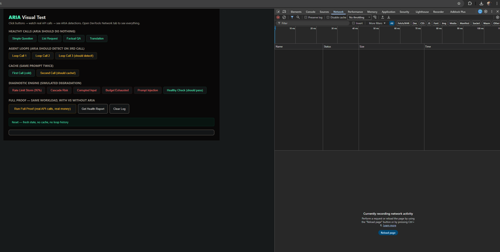

# ARIA

**Guardrails for AI agents. Detect failures. Stop them before they burn your money.**

ARIA sits between your app and your AI provider. It catches agent loops, cascading retries, budget overruns, corrupted input, and infrastructure failures — and blocks them in real-time.

Built for developers and teams running AI agents or high-volume LLM workloads.

---

## Why This Matters

Agent loops are the failure everyone knows about — your agent repeats the same call 100 times and the bill spikes. Easy to spot.

**The expensive failures are the ones you can't see:**

Your app hits a rate limit. Your retry logic resends the failed calls. Those retries add more traffic. More calls fail. More retries. Each retry resends the full conversation context — paying for all tokens again. In 10 minutes, you've spent 5x your normal cost and got mostly errors.

You look at your bill and think "busy day." What actually happened: your system amplified its own failure, and $160 of that $200 bill was pure waste. If something had paused at the start, you'd have spent $45.

40% of AI agent projects get canceled due to cost overruns (Gartner). It's not that AI is expensive — it's that failures multiply silently.

ARIA stops them.

---

## See It In Action



---

## Setup (5 minutes)

### Node.js

```bash
npm install github:clutchitggs/ARIA
```

```js
const Aria = require("aria-sdk");

const aria = new Aria({
  provider: "anthropic",
  apiKey: process.env.ANTHROPIC_API_KEY,
  diagnosticEndpoint: "https://aria-seven-umber.vercel.app/api/diagnose"
});

const result = await aria.call({
  model: "claude-sonnet-4",
  messages: [{ role: "user", content: "..." }],
  max_tokens: 1000
});
```

### Python

```bash
pip install git+https://github.com/clutchitggs/ARIA.git#subdirectory=python
```

```python
from aria import Aria

aria = Aria(
    provider="anthropic",
    api_key=os.environ["ANTHROPIC_API_KEY"],
    diagnostic_endpoint="https://aria-seven-umber.vercel.app/api/diagnose"
)

result = aria.call(
    model="claude-sonnet-4",
    messages=[{"role": "user", "content": "..."}],
    max_tokens=1000
)
```

---

## Health Report

After running for a few days, check what ARIA found:

```python
print(aria.get_report()["text"])
```

```
ARIA Health Report
-----------------------------------------
Calls monitored:        4,208
Agent loops found:      3     — $14.80 wasted so far
Infrastructure risks:   1     — $6.20 would have been wasted
Repeated prompts:       47    — $3.40 spent on duplicate calls
-----------------------------------------
Total waste detected:   $24.40
These failures are happening in your system right now.
False positives:        0
Quality impact:         ZERO (your AI output was never touched)

ARIA can prevent these automatically. Request a prevention key to activate.
```

---

## Two Modes

### Detection (default — safe, zero risk)

ARIA watches your traffic and reports what it finds. Doesn't block or change anything. Start here to see what's going on in your system.

```python
aria = Aria(provider="anthropic", api_key="...")
```

### Prevention (beta — actually stops failures)

ARIA actively blocks agent loops, enforces budgets, prevents cascades. Same detection engine, but now it intervenes before money is wasted.

```python
aria = Aria(provider="anthropic", api_key="...", activation_key="your-key")
```

Prevention mode blocks:
- **Agent loops** — caught at call #3, before call #100
- **Duplicate calls** — cached response returned instantly, $0 cost
- **Budget overruns** — hard stop when budget hits $0
- **Cascade failures** — blocked when infrastructure health degrades
- **Corrupted input** — blocked before it reaches the model
- **Prompt injection** — quarantined before it hijacks your agent

**Want a prevention key?** DM me or open an issue. Free during beta.

---

## How It Works

ARIA monitors every API call using:

- **Pattern detection** — identifies stuck agents, repeated calls, attack signatures
- **Cross-call tracking** — monitors rate limits, latency, error rates, and budget across calls (not per-call — across your whole session)
- **Signal correlation** — combines multiple weak signals to catch cascades no single metric would reveal
- **Active intervention** — in prevention mode, blocks calls that would fail or waste money

Local checks (loops, security, cache) run on your machine. Infrastructure health analysis runs on ARIA's diagnostic server — it receives only numbers (rate limit %, latency, error rate), never prompts or API keys.

---

## Validation

### Real API Proof

354 real API calls across Anthropic, OpenAI, and Google. Real money. Real tokens.

| Test | Result |
|---|---|
| 220 healthy calls | **0 false positives** — never interfered with healthy traffic |
| 30 repeated prompts | **30/30 caught** |
| 12 stuck agents | **12/12 blocked at call #3** |
| Budget exhaustion | **Detected and enforced** from real spend tracking |
| Error accumulation | **72.7% error rate caught** from real API failures |
| 10 diagnostic scenarios | **10/10 correct** — 5 blocked, 5 passed through |

### Scale Test (4,985 cases)

| Detection | Catch Rate |
|---|---|
| Agent loops | **100%** |
| Cascade failures | **100%** |
| Budget overruns | **100%** |
| Rate limit storms | **94-100%** |
| Injection attacks | **93-100%** |
| **False positives** | **0** |

---

## Supported Languages

| Language | Install |
|---|---|
| **Node.js** | `npm install github:clutchitggs/ARIA` |
| **Python** | `pip install git+https://github.com/clutchitggs/ARIA.git#subdirectory=python` |

## Supported Providers

| Provider | Models |
|---|---|
| Anthropic | Claude Opus, Sonnet, Haiku |
| OpenAI | GPT-4o, GPT-4.1, o4-mini, etc. |
| Google | Gemini Pro, Flash |

---

## FAQ

**Can ARIA break my app?**
In detection mode: impossible — it only observes. In prevention mode: ARIA is fail-safe. If ARIA crashes or the diagnostic server is unreachable, your call goes through normally.

**Can ARIA slow my app?**
Local checks add <1ms. The diagnostic check adds ~50-100ms. Skip the diagnostic endpoint if latency matters.

**Can ARIA see my prompts?**
No. Only health numbers reach the diagnostic server. Read the source code to verify.

**How do I get a prevention key?**
DM me or open an issue on this repo. Free during beta.

**What if I don't like it?**
Remove 3 lines. Everything goes back to how it was.

---

## License

Business Source License 1.1 — Free to use in your apps. Cannot be used to build a competing product. See LICENSE for details.
